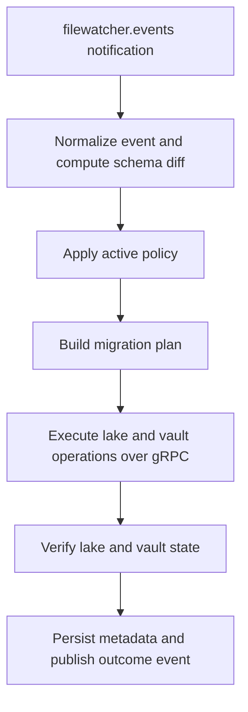
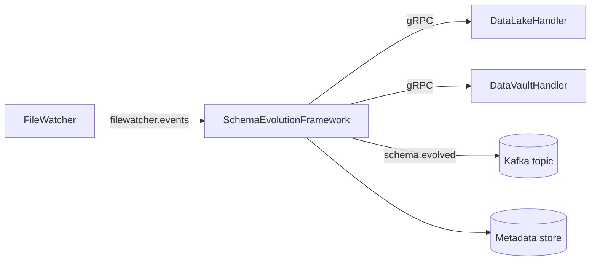

# SchemaEvolutionFramework

SchemaEvolutionFramework evaluates incoming schema notifications, applies the configured policy, constructs migration
plans, coordinates handler execution, and verifies the resulting lake and vault state.

## Responsibilities

- Consume schema notifications from `filewatcher.events`.
- Classify schema changes and determine compatibility.
- Apply the selected policy, typically `production` or `sandbox`.
- Build execution plans for DataLakeHandler and DataVaultHandler.
- Publish schema-evolution outcome events.
- Verify post-execution lake and vault state.

## Architecture

### Mermaid processing flow



The refactored service separates policy and planning rules from infrastructure concerns.

- `domain/` contains normalization and plan-shaping helpers.
- `core/` contains policy evaluation, planning, execution, verification, and publishing.
- `handler/` contains gRPC client adapters for lake and vault handlers.
- `helper/` contains metadata, Spark, Kafka, and metastore support.

## Runtime interfaces

### Inputs

- Kafka topic: `filewatcher.events`
- metadata store state
- gRPC discovery and execution responses from DataLakeHandler and DataVaultHandler

### Outputs

- Kafka topic: `schema.evolved`
- persisted execution and verification metadata
- gRPC requests to the lake and vault handlers

## Configuration

The primary configuration source is the repo-local `.env` file.

Key groups in `.env`:

### Policy and execution

- `SEF_DEFAULT_POLICY`
- `LAKE_HANDLER_GRPC_TARGET`
- `VAULT_HANDLER_GRPC_TARGET`

### Kafka

- `KAFKA_BOOTSTRAP_SERVERS`
- `KAFKA_TOPIC_NOTIFICATION`
- `KAFKA_TOPIC_SCHEMA_EVOLVED`
- `KAFKA_GROUP_ID`
- `KAFKA_MAX_OFFSETS_PER_TRIGGER`

### Metadata

- `METADATA_LINEAGE_TYPE`
- `METADATA_LINEAGE_PATH`
- `METADATA_METADATA_PATH`
- `METASTORE_DB_*`

### Spark and paths

- `SPARK_*`
- `CHECKPOINT_PATH`
- `STAGING_BASE_PATH`
- `RAW_VAULT_BASE_PATH`

## Environment variables

Keep service targets, credentials, and storage locations in the environment. Keep performance and Spark tuning in
configuration and expose them only as optional overrides.

### Required environment variables

Set these values explicitly for every deployment.

```dotenv
# Policy and execution
SEF_DEFAULT_POLICY=production
LAKE_HANDLER_GRPC_TARGET=DataLakeIngestionHandler:50051
VAULT_HANDLER_GRPC_TARGET=DatavaultIngestionHandler:50052

# Kafka
KAFKA_BOOTSTRAP_SERVERS=kafka:9092
KAFKA_TOPIC_NOTIFICATION=filewatcher.events
KAFKA_TOPIC_SCHEMA_EVOLVED=schema.evolved
KAFKA_GROUP_ID=schema-evolution-framework

# Metadata and metastore
METADATA_LINEAGE_TYPE=file
METADATA_LINEAGE_PATH=/app/meta/lineage
METADATA_METADATA_PATH=/app/meta/metadata
METASTORE_DB_HOST=postgres
METASTORE_DB_PORT=5432
METASTORE_DB_NAME=metastore
METASTORE_DB_USER=postgres
METASTORE_DB_PASSWORD=change_me

# Paths
CHECKPOINT_PATH=/tmp/sef/checkpoints
STAGING_BASE_PATH=/data/staging
RAW_VAULT_BASE_PATH=/data/raw_vault
```

### Optional overrides

Only set these when the deployment needs behavior different from the built-in defaults.

```dotenv
KAFKA_MAX_OFFSETS_PER_TRIGGER=100

SPARK_MASTER=local[*]
SPARK_DRIVER_MEMORY=2g
SPARK_EXECUTOR_MEMORY=2g
```

## Data flow

### Mermaid data-flow diagram



1. FileWatcher emits a schema notification to `filewatcher.events`.
2. SchemaEvolutionFramework normalizes the notification and computes the schema diff.
3. The selected policy decides whether the change is allowed, blocked, or requires compensation.
4. A migration plan is built for zero or more handler operations.
5. DataLakeHandler and DataVaultHandler are called over gRPC.
6. The final lake and vault state is re-verified.
7. A success or failure event is published to `schema.evolved`.

## Operations

### Local run

```bash
pip install -r requirements.txt
python main.py
```

### Docker Compose

```bash
docker compose up --build
```

## Licensing model

This repository is licensed under the Apache License, Version 2.0. Redistribution and derivative work are permitted
under the terms in `LICENSE`. Runtime policies, deployment data, and environment secrets are operational assets and are
not relicensed by the code repository.
